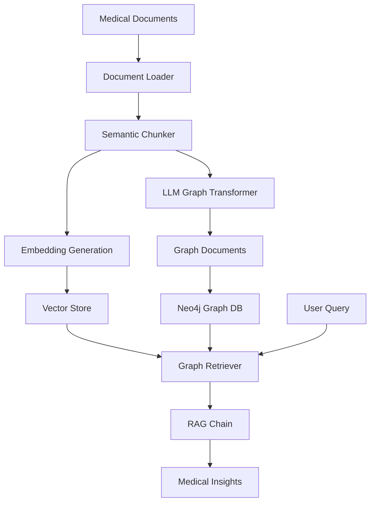

# System Architecture

## Overview

The GraphRAG Medical Analysis System is built on a modular architecture designed for scalability, maintainability, and extensibility in medical document processing and knowledge extraction.

## Core Components

### 1. Document Processing Layer (`processing_pipeline.py`)

**Purpose**: Handle ingestion and preprocessing of medical documents

**Components**:
- Document loaders (DOCX, PDF support planned)
- Semantic chunking using embedding-based segmentation
- Metadata extraction and preservation
- Document validation and quality checks

**Key Functions**:
```python
load_and_chunk_documents() -> List[Document]
```

### 2. Graph Construction Layer (`graph.py`)

**Purpose**: Build and manage the medical knowledge graph

**Components**:
- LLM-based entity extraction
- Relationship identification and mapping
- Graph document generation
- Neo4j integration and storage

**Key Functions**:
```python
store_graph_documents(graph_documents)
create_rag_chain(vector_store)
```

### 3. Retrieval-Augmented Generation Engine

**Purpose**: Provide intelligent querying capabilities

**Components**:
- Hybrid retrieval strategy (vector + graph)
- Context aggregation from multiple sources
- Response generation with medical domain awareness
- Query optimization for clinical terminology

## Data Flow Architecture



## Component Details

### LLM Integration

**Primary Model**: Google Gemini 2.5 Flash Preview
- **Reasoning**: Balance of performance and cost for medical text processing
- **Capabilities**: Complex medical reasoning, entity extraction, relationship identification

**Embedding Model**: Google Generative AI Embeddings (gemini-embedding-exp-03-07)
- **Purpose**: Semantic similarity for document retrieval
- **Optimization**: Fine-tuned for medical terminology

### Graph Database Schema

**Neo4j Implementation**:
```cypher
// Core entities
(:Patient)-[:HAS_CONDITION]->(:MedicalCondition)
(:Patient)-[:TAKES_MEDICATION]->(:Medication)
(:MedicalCondition)-[:TREATED_WITH]->(:Treatment)
(:Medication)-[:INTERACTS_WITH]->(:Medication)
(:Condition)-[:COMORBID_WITH]->(:Condition)

// Multimorbidity patterns
(:Patient)-[:HAS_MULTIMORBIDITY]->(:MultimorbidityPattern)
(:MultimorbidityPattern)-[:INCLUDES]->(:MedicalCondition)
```

### Retrieval Strategy

**Eager Strategy Implementation**:
- Vector similarity search for semantic matching
- Graph traversal for relationship discovery
- Context fusion from multiple retrieval paths
- Ranking based on clinical relevance

## Multimorbidity-Specific Architecture

### Specialized Components

1. **Comorbidity Pattern Detector**
   - Identifies common condition clusters
   - Maps interaction networks between diseases
   - Tracks temporal progression patterns

2. **Treatment Interaction Analyzer**
   - Models drug-drug interactions in multimorbid patients
   - Identifies contraindications across conditions
   - Optimizes treatment sequencing

3. **Cost Analysis Integration**
   - Healthcare utilization modeling
   - Economic impact assessment
   - Resource allocation optimization

### Data Models

**Multimorbidity Entity Types**:
- `Patient` (demographics, history)
- `Condition` (diagnosis, severity, duration)
- `Treatment` (medications, procedures, lifestyle)
- `Outcome` (clinical endpoints, quality measures)
- `Cost` (direct, indirect, opportunity costs)

## Scalability Considerations

### Horizontal Scaling

- **Document Processing**: Parallel processing of document batches
- **Graph Construction**: Distributed entity extraction
- **Query Processing**: Load balancing across multiple instances

### Performance Optimization

- **Caching**: Embedding cache for repeated document processing
- **Indexing**: Optimized Neo4j indexes for medical entities
- **Batching**: Bulk operations for graph updates

## Security & Privacy

### Data Protection

- **Local Processing**: All sensitive data remains within controlled environment
- **Encryption**: At-rest encryption for graph database
- **Access Control**: Role-based access to medical knowledge

### Compliance Framework

- **HIPAA Considerations**: De-identification of patient data
- **Research Ethics**: Appropriate use of medical literature
- **Data Governance**: Clear data lineage and audit trails

## Monitoring & Observability

### System Health Metrics

- Document processing throughput
- Graph construction accuracy
- Query response times
- Resource utilization patterns

### Medical Quality Metrics

- Entity extraction precision/recall
- Relationship accuracy validation
- Clinical relevance scoring
- User satisfaction measures

## Extension Points

### Plugin Architecture

1. **Document Processors**: Support for additional file formats
2. **Entity Extractors**: Domain-specific extraction models
3. **Relationship Mappers**: Custom relationship types
4. **Query Handlers**: Specialized query patterns

### Integration Interfaces

- **FHIR Integration**: Healthcare interoperability standard
- **EHR Connectivity**: Electronic health record systems
- **Clinical Decision Support**: Integration with CDS platforms
- **Research Platforms**: Academic research tool integration

## Deployment Options

### Development Environment
- Local Neo4j instance
- Python virtual environment
- Development API keys

### Production Environment
- Neo4j Enterprise cluster
- Container orchestration (Docker/Kubernetes)
- Production-grade API management
- Monitoring and alerting systems

### Cloud Deployment
- Neo4j AuraDB for managed graph database
- Google Cloud AI Platform integration
- Scalable compute resources
- Enterprise security controls

## Future Architecture Enhancements

### Planned Improvements

1. **Real-time Processing**: Stream processing for continuous updates
2. **Multi-modal Integration**: Support for medical images and structured data
3. **Federated Learning**: Privacy-preserving model updates
4. **Edge Computing**: Deployment at point of care
5. **Blockchain Integration**: Secure, verifiable medical knowledge provenance

### Research Directions

- **Causal Inference**: Beyond correlation to causation in medical relationships
- **Temporal Modeling**: Time-series analysis of disease progression
- **Personalization**: Individual patient risk modeling
- **Population Health**: Aggregate analysis for public health insights